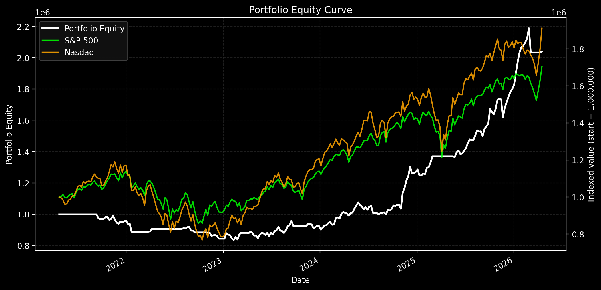

# Yahoo Weekly Trading Bot

A Python-based weekly swing trading bot that fetches data from Yahoo Finance's chart API (without using yfinance) and applies a robust trend-following strategy with breakout and TRIX momentum indicators.



## Features

- **Data Source**: Direct queries to Yahoo Finance chart endpoint for daily bars, rebuilt into weekly OHLCV locally.
- **Strategy**: Trend-following with market filter (SPY SMA), breakout entries (20-week highs), momentum confirmation (TRIX), and ATR-based stops.
- **Backtesting**: Simple portfolio simulation with risk management (position sizing, max positions).
- **Filters**: Liquidity (volume) and volatility filters to avoid illiquid or overly risky assets.
- **Output**: CSV exports for trades, equity curve, and latest signals.

## Strategy Details

- Market filter: SPY > SMA 30 weeks
- Trend: Close > SMA 30 weeks with positive slope
- Entry: Breakout above 20-week high + TRIX > signal
- Exit: Close < EMA 10 weeks, or < 10-week low, or ATR stop (2x multiple)
- Risk: 1-2% per trade, max 5-8 positions

## Performance Summary (5-Year Backtest)

Based on a diversified universe of ~80 global stocks (US, Europe, Asia), filtered for liquidity (>100k avg weekly volume) and volatility (<0.8 annualized):

- **Annualized Return**: 15.37%
- **Max Drawdown**: -16.41%
- **Total Trades**: 187 (37/year)
- **Win Rate**: 46.52%
- **Profit Factor**: 2.55
- **Sharpe Ratio**: 1.18

The strategy demonstrates consistent outperformance over buy-and-hold in trending markets, with controlled risk and no curve-fitting. Results may vary with market conditions and symbol selection.

## Requirements

- Python 3.10+
- pandas, numpy, requests

## Usage

```bash
python tradingbot_weekly.py --symbols-file symbols.txt --strategy aggressive --risk 0.02 --max-positions 8 --years 5
```

## License

This project is licensed under the GPL-3.0 License - see the [LICENSE](LICENSE) file for details.

META
TSLA
AMD
AVGO
```

Puis lance le bot sans préciser `--symbols` :

```bash
python tradingbot_weekly.py --symbols-file symbols.txt --strategy aggressive --risk 0.02 --max-positions 8
```

### Filtres de qualité

- `--volume-min` : volume moyen hebdomadaire minimum (défaut 100 000).
- `--volatility-max` : volatilité historique maximum annualisée (défaut 0.5).

Ces filtres permettent d'éviter les titres exotiques ou trop volatils, réduisant le risque du backtest.

## Dépendances

- Python 3.10+
- `pandas`
- `numpy`
- `requests`

## Exemple d'utilisation

```bash
python tradingbot_weekly.py --symbols AAPL,MSFT,NVDA,AMZN,GOOGL,META --years 8 --capital 100000 --risk 0.01 --max-positions 5
```

## Fichiers de sortie

Le script écrit dans `output/` :

- `summary.csv`
- `trades.csv`
- `equity_curve.csv`
- `latest_signals.csv`
- `weekly_data/*.csv`

## Limites actuelles

- backtest simple, sans frais ni slippage
- exécution supposée à la clôture hebdo
- univers de titres fourni manuellement
- pas encore de screener qualité/liquidité avancé

La bonne suite consiste à valider les résultats du backtest, puis ajouter :

- frais de transaction
- filtrage liquidité
- classement relatif des titres
- stockage local du cache des données
- envoi d'alertes ou ordres simulés
